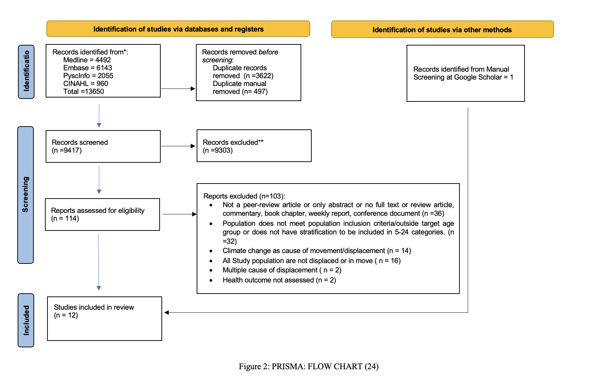
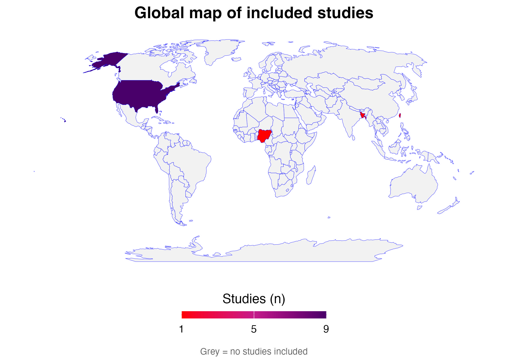
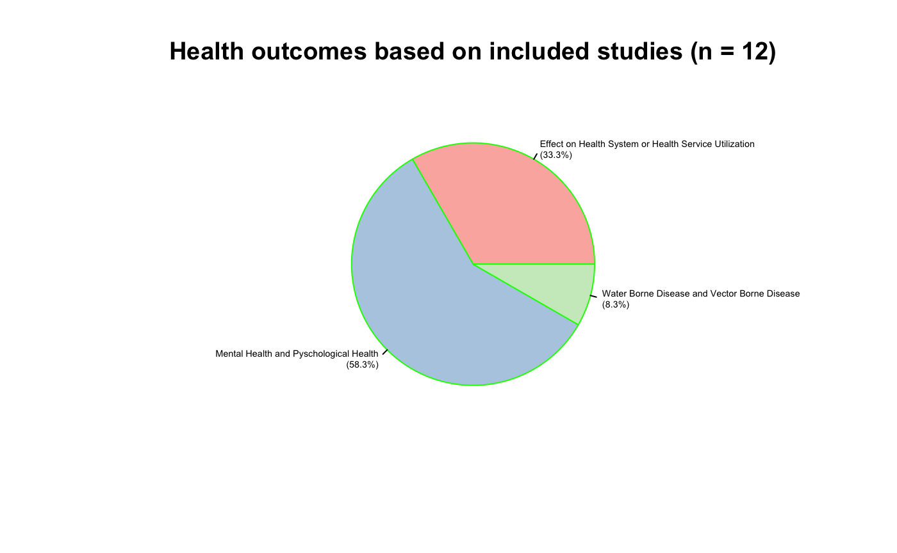
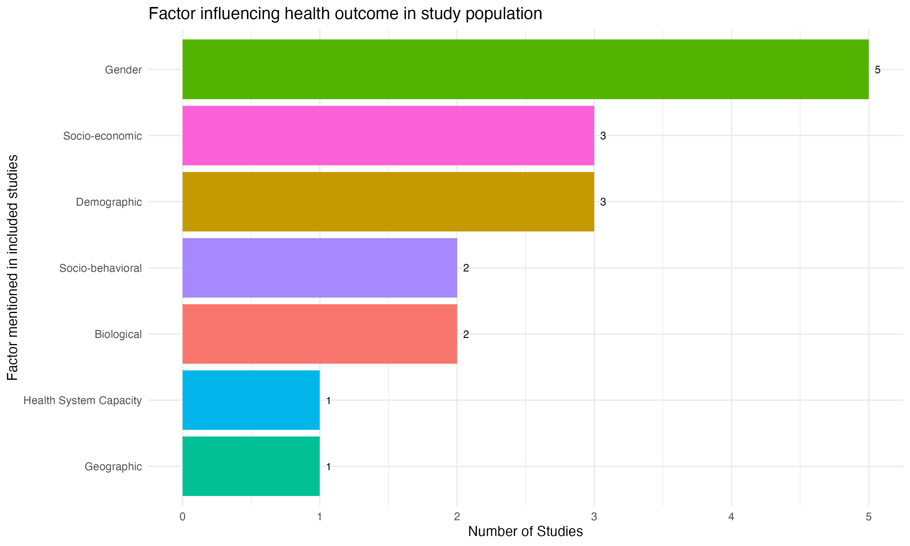

**MYCP SCOPING REVIEW PROJECT**

_***Copyright and intellectual property for this protocol belong to Raghav Khanal, Sri Hari Govind, Rachael Barrett, Mahim Eaty, Oumnia Bouaddi, and Hasheem Mannan. Users of this protocol should cite the original publication accordingly ***._

Please do use this following citation while using this review protocal:

APA style "Khanal, R., Govind, S., Barrett, R., Eaty, M., & Bouaddi, O. (2026, March 16). Health Outcomes Among Children and Youth in Climate-Related Migration: A Scoping Review. https://doi.org/10.17605/OSF.IO/PJKNC"

This review in title "Health Outcomes among children and youth in climate-related migration: A Scoping Review"

The objective of this review is to assess the health impact and challenges faced as a result of climate change migration on this under-studied population. 
Previous systematic and scoping reviews have noted the adverse health consequences arising from climate change associated displacement, but failed to focus on this vulnerable population.To fill this gap, with the intention of spurring research and policy adapted to the needs of this young population, we ask:

●	According to existing literature, what are the health outcomes of climate change migration on children and youth? 
●	Where is further research needed to inform meaningful policy to protect the health of young climate migrants?

METHOD
To answer these questions, we will perform a scoping review of peer-reviewed literature based on the framework of Arksey and O’Malley and in alignment with the PRISMA-ScR guidelines 

Brief of Results:
This review to map the existing evidence in Health Outcomes Among Children and Youth of in Climate-Related Migration, Out of total 13650 search results from 4 major biomedical databases and 1 result from manual search, we included 12 article after duplication resolving, title and abstract screening, full-text screening processes based on inclusion and exclusion criteria. 
# 12 Articles were included in final synthesis

# Map of included articles (Taiwan,Bangladesh,Nigeria and USA)

# 3 Major health outcomes reported in the included study

# Factors associated with health outcomes in the included studies

# Data extraction table

## 📁 Repository Structure

This repository contains the **search records, extracted data, analysis files, review documents, and visual outputs** supporting the scoping review. The materials are organised to facilitate transparency and reproducibility.

| Folder / File                | Description                                                                            |
| ---------------------------- | -------------------------------------------------------------------------------------- |
| 📂 **`All RIS File/`**       | RIS files retrieved from the **four bibliographic databases** searched for the review. |
| 📂 **`dataextraction/`**     | Data used for study extraction, analysis, and reporting.                               |
| ├── `analysis.xlsx`          | Dataset used as the input for the R-based analysis.                                    |
| └── `Included Article.xlsx`  | Detailed characteristics and extracted information for the included studies.           |
| 📂 **`Documents/`**          | Core review documents and supporting materials.                                        |
| ├── `Protocol_MYCP.docx`     | Protocol for the scoping review.                                                       |
| ├── `Search Strategy.docx`   | Complete search strategies used across the four databases.                             |
| ├── `Results.docx`           | Search, screening, and PRISMA flow results.                                            |
| └── `table1.docx`            | Descriptive summary of the included studies.                                           |
| 📂 **`Images/`**             | Figures and visualisations generated during the analysis (`.png` and `.jpg`).          |
| 📄 **`Draft of paper.docx`** | Current manuscript draft; the manuscript is under development.                         |
| 📄 **`MYCPMARKDOWN.html`**   | HTML output of the R Markdown analysis, containing the analysis workflow and results.  |

### 🔬 Reproducibility

The analysis can be reproduced using the dataset provided in:

`dataextraction/analysis.xlsx`

The analysis workflow and generated results are available in:

`MYCPMARKDOWN.html`

Together, these materials provide the **data → analysis → visualisation → results** workflow used in this review.

- Thank you

## Note this review is still ongoing and with some improvisation the review will be carried as Asia Pacifica Regional Network in Early Childhood Development Fellowship 2026
